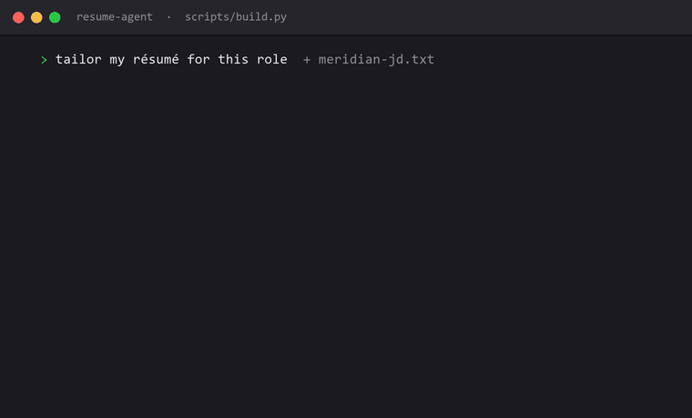
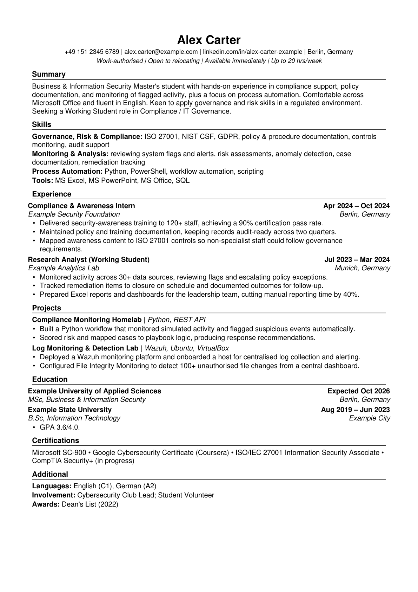

# 🤖 AI Resume Rewriting Agent

> Paste a job description → get a tailored, ATS-optimized, one-page résumé (PDF + Overleaf-ready LaTeX) **and a market-correct cover letter** — tuned for the German and wider European job market.




A hybrid AI agent: **Claude does the judgement** (gap analysis, keyword rewrite, fix loop) and **deterministic Python does the building and scoring** (LaTeX/PDF rendering, ATS audit). The result is reproducible and honest — the agent reframes your real experience to match a target role, but never invents employers, metrics, or certifications.

It runs your résumé through three expert personas in sequence:

| Persona | Job |
|---|---|
| 🕵️ **Senior Recruiter** | Blunt gap analysis: match score, missing keywords, skills gaps |
| ✍️ **Resume Writer** | Rewrites with achievement-formula bullets and woven keywords |
| ⚙️ **ATS Engine** | Scores the result 0–100 and drives a fix loop to ≥ 92 |

## Demo

The example résumé ([`base/resume.example.yaml`](base/resume.example.yaml), fictional "Alex Carter") tailored to the sample GRC working-student JD in [`samples/`](samples/) scores **96/100**:



Full demo output: [`examples/sample-output/`](examples/sample-output/) — PDF, LaTeX, and the [ATS report JSON](examples/sample-output/ats_report.json).

## How it works — the pipeline

1. **Inputs & market classification.** Take the job description, read your master résumé (`base/resume.yaml`) and the [Germany/Europe market playbook](.claude/skills/resume-agent/references/de-eu-playbook.md), classify the JD (language, country, company type, role type) and decide CV language, section labels, photo policy, and keyword-mirroring plan.
2. **Gap analysis** *(recruiter persona)* → `gap_analysis.md`: match score 1–10, top-10 missing ATS keywords (exact JD phrases, in the JD's language), skills gaps, terminology, seniority-language check, unaddressed requirements, market-fit flags (work authorization, availability, German level).
3. **Rewrite** *(writer persona)* → a tailored `resume.yaml`: "Achieved X by Y resulting in Z" bullets, a different action verb per bullet, 2–3 quantified results per role, top-10 keywords woven in naturally. **Nothing is invented** — only true content is reframed and re-weighted — and **nothing may read as AI-written** (the playbook bans the giveaway words and structures).
4. **ATS scan** *(ATS-engine persona)* → renders the résumé, runs the deterministic audit, writes `ats_report.md` with estimated rank, red flags, and weak sections.
5. **Fix loop.** Edit and rebuild until **ATS score ≥ 92 and the PDF is exactly one page** (max 4 iterations).
6. **Cover letter + export.** Write and render a DIN 5008-informed cover letter (German Anschreiben or English letter, 250–400 words), then deliver `resume.pdf`, `resume.tex` (for [Overleaf](https://overleaf.com)), and `cover_letter.pdf` with an application-package checklist (enclosures, combined-PDF order, knockout-question answers).

### Germany/Europe support

The agent follows a researched, source-verified playbook for the German market (and a country table for the rest of Europe): tabular-CV conventions, photo policy by company type, work-authorization phrasing for non-EU applicants, Werkstudent availability/conversion framing, DIN 5008 Anschreiben structure, German↔English GRC keyword pairs, and the parse-and-rank reality of German ATS (Personio, SuccessFactors, softgarden & co). German CVs get German section headers (`labels:`), `MM/YYYY` dates, and `ngerman` LaTeX; the audit accepts both English and German styles.

## Quickstart

```bash
git clone https://github.com/darshan2209/ai-resume-agent.git
cd ai-resume-agent
pip install -r requirements.txt

# Create your master résumé from the template, then edit it with your details:
cp base/resume.example.yaml base/resume.yaml      # Windows: copy base\resume.example.yaml base\resume.yaml

# Tailor it to a job — put the JD in a text file and the key phrases (one per line):
python scripts/build.py base/resume.yaml \
    --jd samples/sample_jd.txt \
    --keywords samples/sample_keywords.txt \
    --outdir output/my-application
```

You get `output/my-application/resume.pdf`, `resume.tex`, and `ats_report.json`, ending with `ATS_SCORE=<n>` and `PAGES=1`. Edit the YAML and rerun until the score clears 92.

> `base/resume.yaml` and everything under `output/` are **gitignored** — your real résumé and tailored applications never get committed.

## Use it as a Claude Code agent (recommended)

The repo ships a [Claude Code](https://claude.com/claude-code) skill at [`.claude/skills/resume-agent/SKILL.md`](.claude/skills/resume-agent/SKILL.md) that automates all five steps from a single message.

1. Copy the skill into your Claude Code skills directory:
   - **macOS/Linux:** `cp -r .claude/skills/resume-agent ~/.claude/skills/`
   - **Windows:** `Copy-Item -Recurse .claude\skills\resume-agent $HOME\.claude\skills\`
2. Open Claude Code in the repo, paste a job description, and say *"tailor my résumé for this."* The agent runs gap analysis → rewrite → ATS scan → fix loop → export end-to-end and hands back the PDF.

## The ATS score (0–100, deterministic)

`scripts/ats_audit.py` extracts the PDF text and scores four categories — no AI, fully reproducible:

| Category | Points | What it checks |
|---|---:|---|
| **Parse integrity** | 30 | Text is extractable, exactly 1 page, email + phone found, standard section headers present |
| **Keyword coverage** | 40 | Share of your target keywords actually present (with plural/hyphen tolerance) |
| **Anti-stuffing** | 10 | No keyword repeated more than 5× (penalizes spammy keyword-stuffing) |
| **Formatting** | 20 | Consistent date style, no mojibake/icon glyphs, sane bullet lengths, contact info at the top |

## Repository layout

```
ai-resume-agent/
├── base/
│   ├── resume.example.yaml   # fictional template — copy to resume.yaml (gitignored)
│   └── resume.yaml           # YOUR master résumé (gitignored, never committed)
├── scripts/
│   ├── render_tex.py         # YAML → Jake's-Resume LaTeX (for Overleaf; EN/DE labels)
│   ├── render_pdf.py         # YAML → ATS-safe 1-page PDF (reportlab, auto-shrink,
│   │                         #   optional German labels + header photo)
│   ├── render_cover_letter.py# YAML → DIN 5008-informed 1-page cover letter PDF
│   ├── ats_audit.py          # deterministic ATS scorer (EN + DE headers/dates)
│   └── build.py              # orchestrator: tex + pdf + audit in one call
├── templates/
│   └── jakes_resume.tex.j2   # Jake's Resume, adapted (no icons → ATS-clean)
├── samples/                  # a sample JD + keyword list to try the pipeline
├── examples/sample-output/   # committed demo run (scores 96/100)
└── .claude/skills/           # the Claude Code agent definition
    └── resume-agent/references/de-eu-playbook.md   # Germany/EU market playbook
```

## Résumé YAML schema

```yaml
lang: en | de                                          # optional; de switches LaTeX babel to ngerman
labels: {summary, skills, experience, ...}             # optional section-header overrides (German CVs)
name: str
contact: {phone, email, linkedin, portfolio, location, tagline, photo}
    # linkedin without https://; portfolio renders as a "Portfolio" hyperlink; tagline may be ""; photo = optional image path (German-style CVs)
summary: str                                           # one paragraph
skills: [{category: str, items: str}]                  # items = ONE comma-separated string
experience: [{company, title, location, start, end, bullets: [str]}]   # end may be "Present"/"heute"
projects: [{name, tech: str, bullets: [str]}]          # tech = ONE comma-separated string
education: [{school, degree, location, start, end, notes: [str]}]      # start may be ""; notes may be []
certifications: [str]
additional: [{label: str, text: str}]
```

The cover-letter YAML schema (sender/recipient blocks, date line, subject, salutation,
paragraphs, closing, enclosures) is documented in the skill definition.

## Why it stays honest

Tailoring résumés with AI invites fabrication. This agent has a hard guardrail baked into every step: **it only reframes, reorders, and re-emphasizes content that already exists in your master résumé.** Numbers come only from your résumé. If a required keyword can't be claimed truthfully, the agent tells you instead of inventing it. The deterministic ATS score means you can trust the number, not just the vibe.

## Credits

- Résumé layout adapted from [**Jake's Resume**](https://github.com/jakegut/resume) by Jake Gutierrez (MIT).
- Built with [pypdf](https://pypdf.readthedocs.io/), [reportlab](https://www.reportlab.com/), [Jinja2](https://jinja.palletsprojects.com/), and [PyYAML](https://pyyaml.org/).

## License

[MIT](LICENSE) © Darshangiri Goswami
